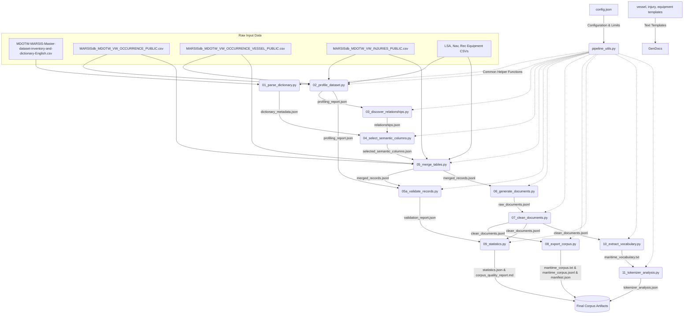

# Maritime NLP Corpus Generation Pipeline Documentation

This document provides a comprehensive, production-grade technical guide to the Maritime NLP Corpus Generation Pipeline. The pipeline is designed to ingest raw, relational maritime accident database views (TSB MARSIS) and transform them into a high-quality, normalized, domain-specific text corpus suitable for pretraining language models like **MaritimeBERT** via Masked Language Modeling (MLM).

---

## 1. Pipeline Architecture Overview

The pipeline is organized as a 12-stage sequential process. Each stage is fully modular, meaning it can be run independently or sequentially via the master orchestrator script ([run_pipeline.py](file:///c:/--Files--/Programming/pipeline/run_pipeline.py)).

### Data Flow and Dependency Graph

The following diagram illustrates how raw CSVs, intermediate jsonl datasets, metadata registries, and validation results flow between the scripts.



---

## 2. Ingested Data Catalog (Input Data Points)

The pipeline ingests seven raw data files located in the `data/` directory, representing the TSB MARSIS (Marine Safety Information System) relational schema. Below are the details of each file compiled from the dataset profiling.

| Dataset File Name | Database Table Identifier | Purpose | Row Count | Primary Key / Key Columns |
| :--- | :--- | :--- | :--- | :--- |
| `MDOTW-MARSIS-Master-dataset-inventory-and-dictionary-English.csv` | N/A | Data dictionary containing field descriptions, data types, and enum translations. | 811 | `Table name`, `Column name` |
| `MARSISdb_MDOTW_VW_OCCURRENCE_PUBLIC.csv` | `MDOTW_VW_OCCURRENCE_PUBLIC` | Occurrences (accidents) master table, describing the event, locations, and weather. | 87,760 | `OccID` (48,594 unique IDs), `OccNo` |
| `MARSISdb_MDOTW_VW_OCCURRENCE_VESSEL_PUBLIC.csv` | `MDOTW_VW_OCCURRENCE_VESSEL_PUBLIC` | Vessels details involved in occurrences (speed, tonnage, flag, activities, etc.). | 73,926 | `VesselID` (27,879 unique IDs), `OccID` |
| `MARSISdb_MDOTW_VW_INJURIES_PUBLIC.csv` | `MDOTW_VW_INJURIES_PUBLIC` | Casualties associated with vessels (minor, serious, fatal, missing injuries). | 23,004 | `VesselID`, `OccID` |
| `MARSISdb_MDOTW_VW_OCCURRENCE_VESSEL_LSA_EQUIPMENT_PUBLIC.csv` | `MDOTW_VW_OCCURRENCE_VESSEL_LSA_EQUIPMENT_PUBLIC` | Life Saving Appliances (LSA) equipment carried by vessels (liferafts, lifeboats, etc.). | 75,257 | `VesselID`, `OccID`, `LsApplianceDisplayEng` |
| `MARSISdb_MDOTW_VW_OCCURRENCE_VESSEL_NAV_EQUIPMENT_PUBLIC.csv` | `MDOTW_VW_OCCURRENCE_VESSEL_NAV_EQUIPMENT_PUBLIC` | Navigation equipment carried by vessels (radars, VHF radios, ECDIS, GPS, etc.). | 314,447 | `VesselID`, `OccID`, `NavigationAidTypeDisplayEng` |
| `MARSISdb_MDOTW_VW_OCCURRENCE_VESSEL_REC_EQUIPMENT_PUBLIC.csv` | `MDOTW_VW_OCCURRENCE_VESSEL_REC_EQUIPMENT_PUBLIC` | Voyage Data Recorders (VDR) and voice recording equipment carried on vessels. | 78,399 | `VesselID`, `OccID`, `RecordingEquipDisplayEng` |

---

## 3. Comprehensive Script-by-Script Analysis

### 3.1. Utility Module: `pipeline_utils.py`

*   **File Path**: [scripts/pipeline_utils.py](file:///c:/--Files--/Programming/pipeline/scripts/pipeline_utils.py)
*   **Purpose**: Houses core helper functions shared across all steps, including directory path resolution, configuration handling, logging setup, safe CSV loading, and automatic dataset detection.
*   **Inputs**:
    *   `config/config.json`
*   **Key Functions & Algorithm**:
    *   `get_project_root()`: Dynamically resolves the absolute path to the pipeline root directory.
    *   `load_config()`: Reads and returns the JSON configuration dictionary.
    *   `setup_logging(stage_name)`: Configures a dual-handler Python logger that writes log lines formatted with timestamps and severity levels to the console and to `outputs/logs/pipeline.log`.
    *   `read_csv_safe(file_path, **kwargs)`: Robust CSV reader. It attempts decoding with `utf-8-sig` (to strip BOM marks) and falls back to `latin-1`. It strips leading and trailing whitespaces from column headers, enforces `low_memory=False` to prevent dtype inference issues, and performs case-insensitive validation on `usecols` filters to prevent crashes on schema drift.
    *   `detect_datasets()`: Iterates over files in the raw data directory, mapping them to standard table names based on filename stems or suffix rules (e.g. matching `"nav"` to navigation equipment).
*   **Outputs**:
    *   Logs written dynamically to standard output and `outputs/logs/pipeline.log`.

---

### 3.2. Stage 01: Data Dictionary Parser

*   **File Path**: [scripts/01_parse_dictionary.py](file:///c:/--Files--/Programming/pipeline/scripts/01_parse_dictionary.py)
*   **Purpose**: Parses the master dataset inventory and metadata dictionary to map numeric IDs/Enums/Flags to English translations and categorizes columns for semantic filtering.
*   **Inputs**:
    *   `MDOTW-MARSIS-Master-dataset-inventory-and-dictionary-English.csv`
*   **Algorithm & Detailed Logic**:
    1.  Clean the inventory dataframe by removing records missing a table name or column name.
    2.  **Display Column Mapping**: The function `map_display_columns()` searches for columns ending in `DisplayEng` or `Display`. For each, it isolates the field prefix (e.g., `AccIncType` from `AccIncTypeDisplayEng`) and identifies potential ID candidates (`AccIncTypeID`, `AccIncTypeEnum`, `AccIncTypeInd`, `AccIncTypeCode`) within the same table. It supports replacement rules for abbreviations (such as mapping `Occ` to `Occurrence` and `Quant` to `Quantity`) and overrides specific anomalies (e.g. mapping `LatEnum_Bearing_DisplayEng` to `latinum`).
    3.  **Semantic Column Categorization**: The function `categorize_column()` scans column names and descriptions to classify columns into:
        *   `admin`: Administrative fields containing strings like `guid`, `xrf`, `version`, `audit`, or `entrydate`.
        *   `temporal`: Date/time indicators (e.g., `date`, `year`, `time`), excluding administrative audit timestamps.
        *   `spatial`: Geographic indicators (e.g., `latitude`, `longitude`, `bearing`, `position`, `port`).
        *   `environmental`: Weather parameters (e.g., `wind`, `sea`, `visib`, `light`, `temp`, `ice`, `wave`).
        *   `equipment`: Navigation or lifesaving devices (e.g., `nav`, `lsa`, `radar`, `compass`, `vdr`).
        *   `casualty`: Accident outcomes (e.g., `injury`, `death`, `fatality`, `missing`, `pollution`, `damage`).
        *   `voyage_activity`: Voyage state and details (e.g., `phase`, `activity`, `voyage`, `cargo`, `towing`).
        *   `vessel_profile`: Vessel characteristics (e.g., `vesseltype`, `tonnage`, `hull`, `propulsion`, `built`, `officialno`).
        *   `narrative`: Large-text narrations and descriptions (e.g., `summary`, `narrative`, `comment`, `note`).
        *   `other`: Columns not matching any of the specific groups above.
    4.  **Boolean Identification**: Flag columns ending in `IND` or having terms like "indicates whether", "flag", "yes/no", or "boolean" in their descriptions as boolean data points.
*   **Outputs**:
    *   `outputs/dictionary_metadata.json` (185.8 KB) containing:
        *   `registry`: Hierarchical dictionary mapping `table_name -> column_name -> metadata` (description, datatype, semantic category, boolean status, and mapped display/ID relationships).
        *   `id_to_display`: Flat map pairing raw IDs to translated display columns.
        *   `display_to_id`: Reverse map pairing display columns back to their raw IDs.
*   **Invariants Established**:
    *   Every column in the dataset registry is assigned a singular semantic class.
    *   Each translation column is successfully linked to its code column for downstream ID pruning.

---

### 3.3. Stage 02: Dataset Profiler

*   **File Path**: [scripts/02_profile_dataset.py](file:///c:/--Files--/Programming/pipeline/scripts/02_profile_dataset.py)
*   **Purpose**: Analyzes columns and record values across all CSV tables to compute uniqueness, cardinality, missing values, and infer primary/foreign keys.
*   **Inputs**:
    *   All detected CSV data files in `data/`
*   **Algorithm & Detailed Logic**:
    1.  Loads each CSV sequentially.
    2.  For every column, calculates:
        *   `null_count`: Total null values.
        *   `nunique`: Total unique values.
        *   `cardinality_ratio`: Ratio of unique values to total rows (`nunique / row_count`).
        *   `data_type`: Internal Pandas dtype.
    3.  **Primary Key Inference**: Flags columns as primary key candidates if they contain zero null values, have a cardinality ratio of `1.0` (or `> 0.95` as a fallback), and the row count is greater than zero.
    4.  **Foreign Key Inference**: Compares columns between all tables. If a non-primary key column in table $T_1$ matches the name and data type of an inferred primary key in table $T_2$ (or matches a column with `> 0.8` cardinality in $T_2$ and contains names like `id`, `no`, or `key`), it is registered as an inferred foreign key candidate.
*   **Outputs**:
    *   `outputs/profiling_report.json` (83.2 KB) outlining row counts, column types, primary key candidates, and foreign key mappings for all tables.
*   **Invariants Established**:
    *   Defines structural parameters (row counts and keys) required for relational graph discovery and join integrity checking.

---

### 3.4. Stage 03: Relationship Schema Discovery

*   **File Path**: [scripts/03_discover_relationships.py](file:///c:/--Files--/Programming/pipeline/scripts/03_discover_relationships.py)
*   **Purpose**: Discovers schema relationships and builds a directed relational graph using the profiling metrics to map valid join paths.
*   **Inputs**:
    *   `outputs/profiling_report.json`
*   **Algorithm & Detailed Logic**:
    1.  Extracts columns containing `id`, `no`, or `key` (excluding count fields like `nolse`).
    2.  **Parent-Child Identification**: For any key shared across multiple tables, the "parent" table is identified as the one having the highest number of unique values for that key (`nunique`). All other tables are designated as child tables.
        *   *Example*: `OccID` has 48,594 unique values in `MDOTW_VW_OCCURRENCE_PUBLIC` (parent) and fewer unique values in equipment and vessel tables (children), indicating a One-to-Many relationship.
    3.  **Directed Graph Construction**: Builds a Directed Graph (`networkx.DiGraph`) where nodes represent tables (annotated with row counts) and edges denote foreign key joins (annotated with join key and relationship type).
*   **Outputs**:
    *   `outputs/relationships.json` (6.9 KB) containing nodes, edges, key parent-child mappings, and join properties.
*   **Invariants Established**:
    *   Formulates a strict directed dependency tree where `OccID` is the root join key, and `VesselID` acts as a sub-relationship join key.

---

### 3.5. Stage 04: Semantic Column Selector

*   **File Path**: [scripts/04_select_semantic_columns.py](file:///c:/--Files--/Programming/pipeline/scripts/04_select_semantic_columns.py)
*   **Purpose**: Filters out administrative metadata, French-language columns, and redundant ID fields, retaining only semantic NLP columns and key joins.
*   **Inputs**:
    *   `outputs/dictionary_metadata.json`
*   **Algorithm & Detailed Logic**:
    1.  Establishes a core set of join keys to preserve: `occid`, `occno`, `vesselid`, `parentvesselid`.
    2.  Iterates over every column in each table registry.
    3.  **Pruning Criteria**:
        *   *French columns*: Drops columns ending in `displayfre` or `fre`.
        *   *Admin columns*: Drops columns labeled with the `admin` category.
        *   *Redundant IDs*: Drops raw ID/Enum columns that have a mapped English display partner (e.g. drops `AccIncTypeID` because `AccIncTypeDisplayEng` is retained).
    4.  Categorizes the remaining columns for downstream template insertion into:
        *   `join_keys`: Joins required for stitching tables.
        *   `display_cols`: Text-based translations of categorical values.
        *   `numeric_attrs`: Quantifiable attributes (e.g., tonnage, length, speed, crew size), excluding coordinates.
        *   `boolean_attrs`: True/False flags.
        *   `narrative_cols`: Raw paragraph text (e.g., accident summaries).
        *   `other_semantic`: Remaining clean text fields.
*   **Outputs**:
    *   `outputs/selected_semantic_columns.json` (7.4 KB) outlining selected columns grouped by category for each table.
*   **Invariants Established**:
    *   Only semantic English content and critical join keys pass to the merging stage, drastically reducing database noise and memory footprints.

---

### 3.6. Stage 05: Data Merging and Aggregation

*   **File Path**: [scripts/05_merge_tables.py](file:///c:/--Files--/Programming/pipeline/scripts/05_merge_tables.py)
*   **Purpose**: Loads raw CSV files using the selected column metadata, aggregates duplicate records, and merges tables into a nested, document-aligned JSONL format using Left Outer Join semantics to guarantee 100% occurrence data retention.
*   **Inputs**:
    *   `outputs/selected_semantic_columns.json`
    *   All raw CSV files listed in [Section 2](#2-ingested-data-catalog-input-data-points)
*   **Algorithm & Detailed Logic**:
    1.  Loads the Occurrence master table and the Vessel table containing only the selected columns.
    2.  **Aggregation (`aggregate_dataframe`)**: Relational views often duplicate records to capture multiple attributes. To resolve this, it groups occurrences by `OccID` and vessels by `VesselID`.
        *   *Text Concatenation*: For columns like `weatherconditiondisplayeng`, `reportedbydisplayeng`, `substantiallyinterestedstatedisplayeng`, and `activitytypedisplayeng`, it concatenates unique, non-empty, and informative values using a semicolon (`;`) separator (e.g., `"clear; fog"`).
        *   *CYthonized first*: For other columns, it aggregates by taking the first non-null value, which is computationally highly efficient.
    3.  Loads child tables (Injuries, LSA, Navigation, and Rec Equipment) containing only selected columns.
    4.  **Nested Structuring & Join Semantics**:
        *   Groups standard child table rows by `VesselID` into lookup dictionaries. Nulls/NaNs are stripped to keep the JSON footprint clean.
        *   Identifies orphan child table records (where `VesselID` is missing/NaN or is not present in standard vessels) and groups them by `OccID`.
        *   Aggregates all orphan child records of an occurrence into exactly **one** placeholder vessel object (`VesselID: null`, `_placeholder: true`, `_reason: "orphan_child_records"`) to prevent duplicate synthetic vessels and retain orphan injuries/equipment.
        *   Groups vessels (both standard and placeholder) by `OccID`.
    5.  Iterates over a complete union of all unique `OccID`s found across occurrences, vessels, and child tables, ensuring no occurrence data is lost.
        *   If an occurrence is completely missing from the master table but has vessels or equipment associated with its `OccID`, a placeholder occurrence is created with `"occurrence": null` and `"_placeholder_occurrence": true` at the root.
    6.  Writes the nested objects line-by-line to a JSONL file.
*   **Outputs**:
    *   `outputs/merged_records.jsonl` (260.5 MB), containing 48,594 nested occurrences.
*   **Invariants Established**:
    *   Guarantees 100% occurrence retention (Left Outer Join).
    *   Aggregates all orphan child attributes under a single placeholder vessel.

### 3.7. Stage 05a: Data Validation and Integrity Check

*   **File Path**: [scripts/05a_validate_records.py](file:///c:/--Files--/Programming/pipeline/scripts/05a_validate_records.py)
*   **Purpose**: Analyzes join integrity, orphan records, missing keys, and implausible numeric values in the merged records.
*   **Inputs**:
    *   `outputs/merged_records.jsonl`
    *   `config/config.json` (defines verification thresholds)
*   **Algorithm & Detailed Logic**:
    1.  **Orphan Analysis**: Scans raw ID columns to verify join integrity:
        *   Identifies child table rows where `OccID` or `VesselID` does not exist in the occurrence or vessel master datasets.
    2.  **Boundary Validation**: Reads the merged JSONL line-by-line, parsing dates and comparing numerical attributes against configuration thresholds:
        *   *Future/Historic Dates*: Warns if the accident date is in the future ($>\text{current year}$) or before 1900.
        *   *Weather limits*: Wind speed $>150\text{ knots}$, air temp outside $[-60^\circ\text{C}, 60^\circ\text{C}]$.
        *   *Vessel limits*: Speed $>100\text{ knots}$, Gross Tonnage $>300,000\text{ GT}$, total crew or passengers $>1,000$.
        *   *Casualty limits*: Minor, serious, or fatal injuries exceeding total crew limits.
        *   *Graceful Null Handling*: Defaulting to an empty dict during date/wind/temp validation if `occurrence` is null (representing a placeholder occurrence), ensuring no `AttributeError` crashes on missing data.
    3.  Compiles warnings and marks the status as `WARNING` if warnings are present, or `PASS` if clean.
*   **Outputs**:
    *   `outputs/validation_report.json` (808 bytes) documenting validation results.
*   **Invariants Established**:
    *   Identifies data anomalies and validates join coverage before document generation.

---

### 3.8. Stage 06: Semantic Document Generation Engine

*   **File Path**: [scripts/06_generate_documents.py](file:///c:/--Files--/Programming/pipeline/scripts/06_generate_documents.py)
*   **Purpose**: Transforms structured, nested database records into multiple semantically focused natural language documents per occurrence to maximize MLM training diversity and semantic coverage while minimizing redundancy.
*   **Inputs**:
    *   `outputs/merged_records.jsonl`
    *   `outputs/dictionary_metadata.json`
    *   `templates/vessel_templates.json`, `templates/injury_templates.json`, `templates/equipment_templates.json`
*   **Detailed Logic & Generation Flow**:
    1.  **Multi-Document Context & Modular Generators**: Instead of exporting a single occurrence document, the engine uses modular, independent generator functions to dynamically yield separate training samples:
        *   `occurrence_summary` (source: `MDOTW_VW_OCCURRENCE_PUBLIC`): Reuses the primary occurrence-level summary.
        *   `environment` (source: `MDOTW_VW_OCCURRENCE_PUBLIC`): Focuses on weather conditions, sea state, wind, and visibility.
        *   `vessel_profile` (source: `MDOTW_VW_OCCURRENCE_VESSEL_PUBLIC`): Details vessel specs, voyages, cargo, damage, and pollution (excluding equipment and injuries).
        *   `vessel_characteristics` (source: `MDOTW_VW_OCCURRENCE_VESSEL_PUBLIC`): Exposes physical stats (hull construction, tonnage, flag state, built year).
        *   `voyage_activity` (source: `MDOTW_VW_OCCURRENCE_VESSEL_PUBLIC`): Describes vessel phase and tasks during the event.
        *   `cargo` (source: `MDOTW_VW_OCCURRENCE_VESSEL_PUBLIC`): Details cargo quantities and categories.
        *   `navigation_equipment` (source: `MDOTW_VW_OCCURRENCE_VESSEL_NAV_EQUIPMENT_PUBLIC`): Uses adaptive levels (Level 1 summary, Level 2 category grouping, Level 3 individual device status sentences).
        *   `lsa_equipment` (source: `MDOTW_VW_OCCURRENCE_VESSEL_LSA_EQUIPMENT_PUBLIC`): Describes life saving appliances.
        *   `recording_equipment` (source: `MDOTW_VW_OCCURRENCE_VESSEL_REC_EQUIPMENT_PUBLIC`): Describes VDR status.
        *   `injury` (source: `MDOTW_INJURIES_PUBLIC`): Details casualties and injury categories.
        *   `integrated_context` (source: `MULTIPLE_TABLES`): Deep operational context connecting weather, cargo, vessel profiles, and active navigation aids into a single description.
    2.  **Information Density Filtering & Redundancy Suppression**:
        *   Enforces a strict minimum info threshold of **50 characters** and **10 words** per document.
        *   Avoids duplicates and redundancy by comparing MD5 hashes of generated texts locally to skip exact duplicate sentences within each occurrence.
    3.  **Linguistic Diversity**: Uses template families with sufficient syntactic variation.
    4.  **Relational Context & Traceability**: Each document retains `occurrence_id`, `vessel_id` (nullable), `document_type`, and `source_table` metadata.
*   **Outputs**:
    *   `outputs/raw_documents.jsonl` containing the generated documents coupled with metadata.
*   **Invariants Established**:
    *   Produces fluent, grammatically correct domain paragraphs while preserving technical facts and metadata traceability.

---

### 3.9. Stage 07: Document Cleaning and Normalization

*   **File Path**: [scripts/07_clean_documents.py](file:///c:/--Files--/Programming/pipeline/scripts/07_clean_documents.py)
*   **Purpose**: Cleans whitespaces, punctuation, duplicate sentences, short documents, and removes duplicate documents across the corpus.
*   **Inputs**:
    *   `outputs/raw_documents.jsonl`
    *   `config.json` (defines `min_doc_length` threshold)
*   **Algorithm & Detailed Logic**:
    1.  **Encoding & Punctuation Clean (`clean_text`)**:
        *   Replaces unicode replacement characters (`\uFFFD`) with a space.
        *   Replaces repeated punctuation marks (e.g. `....` $\rightarrow$ `...`, multiple commas or question marks).
        *   Removes whitespaces preceding punctuation marks.
        *   Normalizes space characters and limits consecutive newlines to two.
    2.  **Sentence-Level Deduplication (`deduplicate_sentences`)**:
        *   Splits paragraphs into sentences using an abbreviation-aware splitter.
        *   Builds sentence splits by checking against common abbreviations (`Mr.`, `Capt.`, `Ltd.`, `co.`, `U.S.`, `i.m.o.`) to prevent incorrect sentence boundaries.
        *   Maintains a hash set of lowercase, whitespace-stripped sentences within each document. If a sentence repeats exactly inside the same document, it is omitted.
    3.  **Length Filtering**: Filters out documents shorter than `min_doc_length` characters (default is 50 characters).
    4.  **Cross-Document Deduplication**: Computes MD5 hashes for each cleaned document. If a document hash has been seen previously, it is discarded as a duplicate.
*   **Outputs**:
    *   `outputs/clean_documents.jsonl` (284.2 MB) containing clean, unique documents.
*   **Invariants Established**:
    *   Ensures all output texts are unique, clean, and meet length requirements, ready for pretraining.

---

### 3.10. Stage 08: Corpus Export

*   **File Path**: [scripts/08_export_corpus.py](file:///c:/--Files--/Programming/pipeline/scripts/08_export_corpus.py)
*   **Purpose**: Exports the final plain text corpus for pretraining and a metadata-aligned JSONL dataset, and writes a build manifest.
*   **Inputs**:
    *   `outputs/clean_documents.jsonl`
*   **Algorithm & Detailed Logic**:
    1.  Reads the cleaned document JSONL dataset.
    2.  **Plain Text Export**: Normalizes line breaks and writes the text files separated by double newlines (`\n\n`), keeping internal lines joined.
    3.  **JSONL Metadata Export**: Saves documents aligned with `occurrence_id` and the nested structured attributes.
    4.  **Manifest Creation**: Captures the current Git commit hash (by running `git rev-parse HEAD`), execution date, document count, and version metadata.
*   **Outputs**:
    *   `outputs/maritime_corpus.txt` (21.2 MB): Plain-text pretraining corpus.
    *   `outputs/maritime_corpus.jsonl` (284.2 MB): Metadata-aligned corpus.
    *   `outputs/manifest.json` (182 bytes): JSON manifest recording statistics:
        ```json
        {
          "version": "1.0",
          "created": "2026-07-16",
          "documents": 48441,
          "source": "MARSIS",
          "language": "English",
          "pipeline_version": "1.0",
          "git_commit": "unknown"
        }
        ```
*   **Invariants Established**:
    *   Produces version-controlled pretraining files in standard BERT pretraining format.

---

### 3.11. Stage 09: Statistics and Quality Reporting

*   **File Path**: [scripts/09_statistics.py](file:///c:/--Files--/Programming/pipeline/scripts/09_statistics.py)
*   **Purpose**: Calculates corpus statistics (Shannon entropy, Type-Token Ratio, lexical diversity, n-gram frequencies) and generates a human-readable quality report.
*   **Inputs**:
    *   `outputs/clean_documents.jsonl`
    *   `outputs/validation_report.json`
*   **Algorithm & Detailed Logic**:
    1.  Tokenizes all documents to lowercased terms, removing punctuation.
    2.  **Linguistic Metrics**:
        *   *Shannon Entropy*: Calculates information density:
            $$H(X) = -\sum_{i=1}^{n} P(x_i) \log_2 P(x_i)$$
        *   *Type-Token Ratio (TTR)*: Evaluates vocabulary diversity (ratio of unique words to total words).
        *   *Sentence/Paragraph Redundancy*: Computes the percentage of duplicate sentences and paragraphs across the corpus.
    3.  **N-Gram Generation**: Extracts contiguous word bigrams and trigrams per document, counting frequencies using `collections.Counter`.
    4.  **Document Length Distribution**: Group word counts into bins (e.g. 0-50, 50-100, 100-200, 200-500, 500+ words).
    5.  Combines validation metrics and formats top terms/n-grams into Markdown tables.
*   **Outputs**:
    *   `outputs/statistics.json` (4.0 KB): Contains raw metric values.
    *   `outputs/corpus_quality_report.md` (3.1 KB): Quality assessment report.
*   **Measured Data Points**:
    *   *Total Documents*: 310,035
    *   *Total Tokens/Words*: 8,273,295 words
    *   *Average Doc Length*: 26.69 words
    *   *Unique Vocabulary*: 43,933 terms
    *   *Lexical Diversity (TTR)*: 0.00531
    *   *Shannon Entropy*: 8.3590 bits
    *   *Duplicate Sentence Rate*: 35.07%
    *   *Duplicate Paragraph Rate*: 0.05%
    *   *Top 3 Bigrams*: `"the vessel"` (150,795), `"a gross"` (88,439), `"gross tonnage"` (88,439)
    *   *Top 3 Trigrams*: `"a gross tonnage"` (88,439), `"gross tonnage of"` (88,439), `"at the time"` (52,066)

---

### 3.12. Stage 10: Domain Vocabulary Extraction

*   **File Path**: [scripts/10_extract_vocabulary.py](file:///c:/--Files--/Programming/pipeline/scripts/10_extract_vocabulary.py)
*   **Purpose**: Extracts domain-specific maritime terminology from the corpus by filtering general English terms and pipeline templates.
*   **Inputs**:
    *   `outputs/clean_documents.jsonl`
    *   `outputs/dictionary_metadata.json`
*   **Algorithm & Detailed Logic**:
    1.  Tokenizes all documents to lowercased words (length $\ge 3$).
    2.  **Stop Word Filtering**: Excludes 75+ common stop words (e.g., `"the"`, `"and"`) and generic pipeline template verbs (e.g., `"reported"`, `"resulted"`, `"sustained"`, `"occurred"`, `"unspecified"`).
    3.  **Domain Matching**: Retains a word if:
        *   It contains one of the predefined maritime stems (e.g., `vess`, `ship`, `hull`, `propel`, `anchor`, `navig`, `lifeboat`, `collision`, `grounding`, `pollution`).
        *   *OR* it appears in the parsed dictionary metadata registry and has a corpus frequency $\ge 5$.
    4.  Sorts terms by frequency and extracts the top 300 words.
*   **Outputs**:
    *   `outputs/maritime_vocabulary.txt` (2.5 KB): Plain-text file containing the top 300 sorted maritime terms (one per line).

---

### 3.13. Stage 11: BERT Tokenizer Analysis

*   **File Path**: [scripts/11_tokenizer_analysis.py](file:///c:/--Files--/Programming/pipeline/scripts/11_tokenizer_analysis.py)
*   **Purpose**: Runs the `bert-base-uncased` tokenizer on the corpus to measure out-of-vocabulary (OOV) rates and subword splits on maritime terms.
*   **Inputs**:
    *   `outputs/maritime_corpus.jsonl`
    *   `outputs/maritime_vocabulary.txt`
*   **Algorithm & Detailed Logic**:
    1.  Loads the Hugging Face `bert-base-uncased` tokenizer.
    2.  Tokenizes the top 50 terms from the extracted vocabulary, recording the split pieces and counts.
        *   *Examples*:
            *   `tonnage` $\rightarrow$ `['ton', '##nage']` (2 pieces)
            *   `echosounder` $\rightarrow$ `['echo', '##so', '##under']` (3 pieces)
            *   `gyro` $\rightarrow$ `['g', '##yr', '##o']` (3 pieces)
    3.  Samples up to 10,000 documents from the corpus, counting whitespace words versus BERT subword tokens.
    4.  Calculates:
        *   `average_subwords_per_word` = $\text{subwords} / \text{raw words}$
        *   `oov_rate` = $\text{[UNK] count} / \text{subwords}$
*   **Outputs**:
    *   `outputs/tokenizer_analysis.json` (705 bytes) containing:
        *   `average_subwords_per_word`: 1.4834 (suggesting mild subword splitting).
        *   `oov_rate`: 0.0 (indicating the vocabulary is fully covered by BERT's pre-trained vocabulary, with no unknown tokens).

---

## 4. Key Data Transformation & Normalization Rules

To produce high-quality language pretraining texts, specific text transformations are applied in Stage 06 and Stage 07:

```
[Raw Relational Row] 
      │
      ▼ (Stage 05 - Aggregation)
[Aggregated Semicolon Concatenated Fields]
      │
      ▼ (Stage 06 - Database Suffix Removal: clean_db_label)
[Suffixes like " - deactivated nov. 1995" Stripped]
      │
      ▼ (Stage 06 - Term Normalization: normalize_label)
[Abbreviations like "gps_receiver" -> "GPS receiver"; acronyms capitalized]
      │
      ▼ (Stage 06 - Conditional Suppression)
[Low-information segments deleted; "No casualty" printed only for major incidents]
      │
      ▼ (Stage 07 - Clean & Deduplicate)
[Unicode markers removed; Sentence duplicate lists filtered; MD5 duplicates dropped]
      │
      ▼
[Final Clean Corpus Document]
```

### Suffix Stripping Rules
Regex pattern `\s*-\s*deactivated\s+\w+\.?\s+\d{4}` and `\s*-\s*.*?(19\d{2}|20\d{2})` are used to remove administrative history suffixes from textual labels.
*   *Example*: `"radar1 - deactivated dec 2004"` $\rightarrow$ `"radar1"`

### Tech Word Normalization Maps
Converts database abbreviations into clean English terminology:
*   `radar1`, `radar2` $\rightarrow$ `radar`
*   `mf/hf` $\rightarrow$ `MF/HF radio`
*   `gps_receiver` $\rightarrow$ `GPS receiver`
*   `ecdis` $\rightarrow$ `ECDIS`
*   `ais` $\rightarrow$ `AIS`

### Low-Information Suppression
If database values contain nulls or placeholder values like `"UNKNOWN"`, `"UNSPECIFIED"`, `"NONE"`, or `"NONE APPARENT"`, the generator completely suppresses sentences containing them instead of emitting low-value placeholder text.
*   *Example*: A damage location of `"UNKNOWN"` or `"NONE APPARENT"` causes the entire damage statement to be skipped.

### Sentence Deduplication Heuristics
Duplicate sentences inside a document are detected by checking a set of normalized sentences (whitespace removed, lowercased, periods stripped). Only the first occurrence is kept.
*   *Sentence Splitting*: Uses an abbreviation lookup to avoid breaking sentences on words like `Capt.`, `Mr.`, `Ltd.`, `U.S.`, `co.`, or `no.`.

---

## 5. Operations & Execution Guide

### Running the Complete Pipeline
To run all 12 stages sequentially:
```bash
python run_pipeline.py
```

### Running Specific Stages
You can rerun individual stages using the `--stage` flag:
```bash
# Parse dictionary and build schemas
python run_pipeline.py --stage 01

# Merge tables and run validations
python run_pipeline.py --stage 05
python run_pipeline.py --stage 05a

# Regenerate corpus documents
python run_pipeline.py --stage 06
python run_pipeline.py --stage 07

# Calculate statistics and reports
python run_pipeline.py --stage 09
```

### Pipeline Settings Configuration
Pipeline execution behavior can be customized in [config/config.json](file:///c:/--Files--/Programming/pipeline/config/config.json):
*   `text_cleaning.min_doc_length`: Minimum document length threshold (default `50` characters).
*   `validation.max_vessel_speed_knots`: Speed check boundary (default `100.0` knots).
*   `validation.max_tonnage`: Tonnage threshold (default `300000.0` GT).
*   `validation.max_crew`: Crew size limit (default `1000`).
*   `generation.default_language`: Text generation target language (default `"Eng"`).
