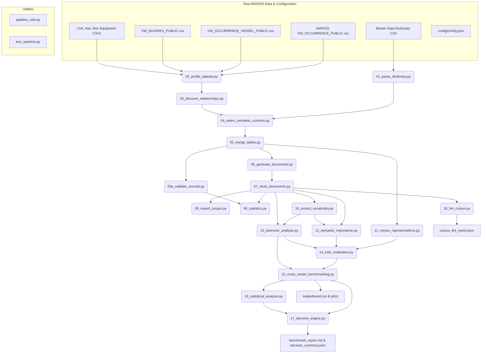

# Maritime NLP Corpus Generation & Evaluation Pipeline Documentation

This document provides a comprehensive, publication-grade technical guide to the **Maritime NLP Corpus Generation & Multi-Model Evaluation Pipeline**. The pipeline ingests raw relational maritime accident databases (TSB MARSIS), constructs multi-format corpus representations, scores semantic importance, benchmarks multi-architecture tokenizers, executes a 175-run Masked Language Model (MLM) evaluation grid across representative model families, performs statistical significance testing & feature ablation, and executes an objective decision engine to select the optimal model adaptation strategy (**Strategy A: DAPT**, **Strategy B: Train from Scratch**, or **Strategy C: Vocabulary-Extended DAPT**).

---

## 1. Complete Pipeline Architecture Overview

The pipeline is organized as an 18-stage modular framework orchestrated by [run_pipeline.py](file:///c:/--Files--/Programming/pipeline/run_pipeline.py). 

### End-to-End Execution Flowchart


```mermaid
flowchart TD
    %% Input Layer
    subgraph Input Layer [Raw MARSIS Data & Configuration]
        DictCSV[Master Data Dictionary CSV]
        OccCSV[MARSIS VW_OCCURRENCE_PUBLIC.csv]
        VesCSV[VW_OCCURRENCE_VESSEL_PUBLIC.csv]
        InjCSV[VW_INJURIES_PUBLIC.csv]
        EqCSVs[LSA, Nav, Rec Equipment CSVs]
        ConfigJSON[config/config.json]
    end

    %% Utility Layer
    subgraph Utilities
        Utils[pipeline_utils.py]
        Sanitizer[text_sanitizer.py]
    end

    %% Data Ingestion & Preprocessing (Stages 01-05a)
    DictCSV --> Stage01(01_parse_dictionary.py)
    OccCSV & VesCSV & InjCSV & EqCSVs --> Stage02(02_profile_dataset.py)
    Stage02 --> Stage03(03_discover_relationships.py)
    Stage01 & Stage03 --> Stage04(04_select_semantic_columns.py)
    Stage04 --> Stage05(05_merge_tables.py)
    Stage05 --> Stage05a(05a_validate_records.py)

    %% Document & Corpus Generation (Stages 06-10)
    Stage05 --> Stage06(06_generate_documents.py)
    Stage06 --> Stage07(07_clean_documents.py)
    Stage07 --> Stage08(08_export_corpus.py)
    Stage07 & Stage05a --> Stage09(09_statistics.py)
    Stage07 --> Stage10(10_extract_vocabulary.py)

    %% Multi-Format & Knowledge Classification (Stages 11-12)
    Stage05 --> Stage11(11_corpus_representations.py)
    Stage07 & Stage10 --> Stage12(12_semantic_importance.py)

    %% Benchmarking & Evaluation Grid (Stages 13-14)
    Stage10 & Stage07 --> Stage13(13_tokenizer_analysis.py)
    Stage11 & Stage12 & Stage13 --> Stage14(14_mlm_evaluation.py)

    %% Analytics & Decision Engine (Stages 15-18)
    Stage14 & Stage13 --> Stage15(15_cross_model_benchmarking.py)
    Stage15 --> Stage16(16_statistical_analysis.py)
    Stage15 & Stage16 --> Stage17(17_decision_engine.py)
    Stage07 --> Stage18(18_lint_corpus.py)

    %% Final Outputs
    Stage15 --> Leaderboard[leaderboard.csv & plots]
    Stage17 --> Report[benchmark_report.md & decision_summary.json]
    Stage18 --> LintReport[corpus_lint_report.json]
```

---

## 2. Ingested Data Catalog (Input Data Points)

The pipeline ingests seven raw data files located in the `data/` directory:

| Dataset File Name | Database Identifier | Domain Purpose | Record Count | Unique Identifiers |
| :--- | :--- | :--- | :--- | :--- |
| `MDOTW-MARSIS-Master-dataset-inventory-and-dictionary-English.csv` | Master Dictionary | Column definitions, data types, enum mappings | 811 rows | `Table name`, `Column name` |
| `MARSISdb_MDOTW_VW_OCCURRENCE_PUBLIC.csv` | `MDOTW_VW_OCCURRENCE_PUBLIC` | Master accident events, locations, weather | 87,760 rows | `OccID` (48,594 unique IDs), `OccNo` |
| `MARSISdb_MDOTW_VW_OCCURRENCE_VESSEL_PUBLIC.csv` | `MDOTW_VW_OCCURRENCE_VESSEL_PUBLIC` | Vessel specs, speed, GT, activity phase | 73,926 rows | `VesselID` (27,879 unique IDs), `OccID` |
| `MARSISdb_MDOTW_VW_INJURIES_PUBLIC.csv` | `MDOTW_VW_INJURIES_PUBLIC` | Injuries, fatalities, missing personnel | 23,004 rows | `VesselID`, `OccID` |
| `MARSISdb_MDOTW_VW_OCCURRENCE_VESSEL_LSA_EQUIPMENT_PUBLIC.csv` | `MDOTW_VW_OCCURRENCE_VESSEL_LSA_EQUIPMENT_PUBLIC` | Life-Saving Appliances (liferafts, boats) | 75,257 rows | `VesselID`, `OccID` |
| `MARSISdb_MDOTW_VW_OCCURRENCE_VESSEL_NAV_EQUIPMENT_PUBLIC.csv` | `MDOTW_VW_OCCURRENCE_VESSEL_NAV_EQUIPMENT_PUBLIC` | Navigation aids (radar, VHF, ECDIS, GPS) | 314,447 rows | `VesselID`, `OccID` |
| `MARSISdb_MDOTW_VW_OCCURRENCE_VESSEL_REC_EQUIPMENT_PUBLIC.csv` | `MDOTW_VW_OCCURRENCE_VESSEL_REC_EQUIPMENT_PUBLIC` | VDR & audio recording equipment | 78,399 rows | `VesselID`, `OccID` |

---

## 3. Comprehensive Stage-by-Stage Script & Logic Documentation

### Utility Modules

#### `pipeline_utils.py`
- **Path**: [scripts/pipeline_utils.py](file:///c:/--Files--/Programming/pipeline/scripts/pipeline_utils.py)
- **Core Purpose**: Centralized utility library providing workspace path resolution (`get_project_root()`), config loading (`load_config()`), standardized logging (`setup_logging()`), robust CSV reading with encoding detection, and string cleaning.

#### `text_sanitizer.py`
- **Path**: [scripts/text_sanitizer.py](file:///c:/--Files--/Programming/pipeline/scripts/text_sanitizer.py)
- **Core Purpose**: Text normalization engine. Enforces uppercase normalization, removes control characters, cleans redundant whitespace, and masks administrative leakage patterns.

---

### Stage 01: Parse Data Dictionary
- **Script**: [scripts/01_parse_dictionary.py](file:///c:/--Files--/Programming/pipeline/scripts/01_parse_dictionary.py)
- **Core Logic**: Parses the master data dictionary CSV (`MDOTW-MARSIS-Master-dataset-inventory-and-dictionary-English.csv`). Extracts table names, column names, technical descriptions, data types, and enumeration mappings into a structured lookup schema.
- **Output Artifact**: [outputs/dictionary_metadata.json](file:///c:/--Files--/Programming/pipeline/outputs/dictionary_metadata.json)

### Stage 02: Profile Datasets
- **Script**: [scripts/02_profile_dataset.py](file:///c:/--Files--/Programming/pipeline/scripts/02_profile_dataset.py)
- **Core Logic**: Scans all 6 raw relational table CSVs. Computes row counts, column counts, missing value ratios, data type distributions, cardinality, and sample values per column.
- **Output Artifact**: [outputs/profiling_report.json](file:///c:/--Files--/Programming/pipeline/outputs/profiling_report.json)

### Stage 03: Discover Schema Relationships
- **Script**: [scripts/03_discover_relationships.py](file:///c:/--Files--/Programming/pipeline/scripts/03_discover_relationships.py)
- **Core Logic**: Analyzes foreign key relationships across tables. Maps primary key `OccID` in `VW_OCCURRENCE` to child tables (`VW_OCCURRENCE_VESSEL`, `VW_INJURIES`, LSA, NAV, REC equipment) and quantifies cardinalities (1-to-Many joins).
- **Output Artifact**: [outputs/relationships.json](file:///c:/--Files--/Programming/pipeline/outputs/relationships.json)

### Stage 04: Select Semantic Columns
- **Script**: [scripts/04_select_semantic_columns.py](file:///c:/--Files--/Programming/pipeline/scripts/04_select_semantic_columns.py)
- **Core Logic**: Scores database columns based on descriptive density, non-null ratio, and domain relevance. Selects semantic attributes (e.g., weather conditions, vessel types, gross tonnage, incident types) for document generation.
- **Output Artifact**: [outputs/selected_semantic_columns.json](file:///c:/--Files--/Programming/pipeline/outputs/selected_semantic_columns.json)

### Stage 05: Merge Datasets
- **Script**: [scripts/05_merge_tables.py](file:///c:/--Files--/Programming/pipeline/scripts/05_merge_tables.py)
- **Core Logic**: Executes a relational join across occurrences, vessels, injuries, and equipment tables grouped by `OccID`. Constructs nested JSON records representing the complete incident context.
- **Output Artifact**: [outputs/merged_records.jsonl](file:///c:/--Files--/Programming/pipeline/outputs/merged_records.jsonl) (346 MB)

### Stage 05a: Validate Records
- **Script**: [scripts/05a_validate_records.py](file:///c:/--Files--/Programming/pipeline/scripts/05a_validate_records.py)
- **Core Logic**: Performs data integrity checks on merged records. Validates `OccID` completeness, key presence, data types, and detects orphaned records.
- **Output Artifact**: [outputs/validation_report.json](file:///c:/--Files--/Programming/pipeline/outputs/validation_report.json)

### Stage 06: Generate Natural Language Documents
- **Script**: [scripts/06_generate_documents.py](file:///c:/--Files--/Programming/pipeline/scripts/06_generate_documents.py)
- **Core Logic**: Applies narrative template rules to construct cohesive, grammatically sound text documents from nested occurrence records.
- **Output Artifact**: [outputs/raw_documents.jsonl](file:///c:/--Files--/Programming/pipeline/outputs/raw_documents.jsonl) (891 MB)

### Stage 07: Clean and Normalize Documents
- **Script**: [scripts/07_clean_documents.py](file:///c:/--Files--/Programming/pipeline/scripts/07_clean_documents.py)
- **Core Logic**: Cleans document text by stripping administrative header leakage, normalizing punctuation, sanitizing irregular characters, and filtering non-semantic fragments.
- **Output Artifact**: [outputs/clean_documents.jsonl](file:///c:/--Files--/Programming/pipeline/outputs/clean_documents.jsonl) (807 MB)

### Stage 08: Export Maritime Corpus & Manifest
- **Script**: [scripts/08_export_corpus.py](file:///c:/--Files--/Programming/pipeline/scripts/08_export_corpus.py)
- **Core Logic**: Exports the clean documents in plain text line-by-line format (`.txt`) and JSONL format, alongside an export manifest detailing SHA-256 checksums and file sizes.
- **Output Artifacts**:
  - [outputs/maritime_corpus.txt](file:///c:/--Files--/Programming/pipeline/outputs/maritime_corpus.txt)
  - [outputs/maritime_corpus.jsonl](file:///c:/--Files--/Programming/pipeline/outputs/maritime_corpus.jsonl)
  - [outputs/manifest.json](file:///c:/--Files--/Programming/pipeline/outputs/manifest.json)

### Stage 09: Calculate Corpus Statistics & Report
- **Script**: [scripts/09_statistics.py](file:///c:/--Files--/Programming/pipeline/scripts/09_statistics.py)
- **Core Logic**: Computes corpus-wide token counts, vocabulary size, sentence length distributions, Type-Token Ratio (TTR), and Markdown summary report.
- **Output Artifacts**:
  - [outputs/statistics.json](file:///c:/--Files--/Programming/pipeline/outputs/statistics.json)
  - [outputs/corpus_quality_report.md](file:///c:/--Files--/Programming/pipeline/outputs/corpus_quality_report.md)

### Stage 10: Extract Maritime Vocabulary
- **Script**: [scripts/10_extract_vocabulary.py](file:///c:/--Files--/Programming/pipeline/scripts/10_extract_vocabulary.py)
- **Core Logic**: Extracts domain-specific maritime terms (vessels, navigation aids, weather phenomena, incident types) using TF-IDF and domain keyword frequency analysis.
- **Output Artifact**: [outputs/maritime_vocabulary.txt](file:///c:/--Files--/Programming/pipeline/outputs/maritime_vocabulary.txt)

### Stage 11: Multi-Format Corpus Representation Generation
- **Script**: [scripts/11_corpus_representations.py](file:///c:/--Files--/Programming/pipeline/scripts/11_corpus_representations.py)
- **Core Logic**: Renders the 96,714 merged occurrence records into **5 multi-format representations**:
  1. **Narrative**: Flowing natural language paragraphs.
  2. **Key-Value**: Structured `Field: Value` formatted lines.
  3. **Template**: Standardized sentence slot templates.
  4. **JSON**: Compact JSON strings.
  5. **Mixed**: Narrative text paired with structured key-value metadata.
- **Output Artifacts**: [outputs/corpus_representations/*.jsonl](file:///c:/--Files--/Programming/pipeline/outputs/corpus_representations) (`narrative.jsonl`, `key_value.jsonl`, `template.jsonl`, `json.jsonl`, `mixed.jsonl`)

### Stage 12: Semantic Importance Assessment & Knowledge Classification
- **Script**: [scripts/12_semantic_importance.py](file:///c:/--Files--/Programming/pipeline/scripts/12_semantic_importance.py)
- **Core Logic**: Evaluates every document using a **9-feature weighted scoring formula**:
  $$\text{Score} = \text{Clip}\Big( 100 \times \sum w_i f_i - 0.10 \times \text{Redundancy} \Big)$$
  Features: Maritime Term Density ($0.30$), Rare Term Count ($0.20$), Concept Diversity ($0.15$), Entity Diversity ($0.10$), Event Complexity ($0.10$), Information Density ($0.10$), Metadata Completeness ($0.05$), Linguistic Diversity ($0.05$), Domain Novelty ($0.05$).
  Generates 6 evaluation subsets under [outputs/subsets/](file:///c:/--Files--/Programming/pipeline/outputs/subsets): `high_knowledge.jsonl`, `medium_knowledge.jsonl`, `low_knowledge.jsonl`, `balanced_knowledge.jsonl`, `random_baseline.jsonl`, and `general_english_baseline.jsonl`.
- **Output Artifacts**:
  - [outputs/document_importance.jsonl](file:///c:/--Files--/Programming/pipeline/outputs/document_importance.jsonl)
  - [outputs/importance_statistics.json](file:///c:/--Files--/Programming/pipeline/outputs/importance_statistics.json)
  - [outputs/importance_distribution.png](file:///c:/--Files--/Programming/pipeline/outputs/importance_distribution.png)
  - Subsets under [outputs/subsets/](file:///c:/--Files--/Programming/pipeline/outputs/subsets)

### Stage 13: Multi-Model Tokenizer Benchmark Analysis
- **Script**: [scripts/13_tokenizer_analysis.py](file:///c:/--Files--/Programming/pipeline/scripts/13_tokenizer_analysis.py)
- **Core Logic**: Evaluates 14 target Hugging Face tokenizers across single-token vocabulary coverage, subword fragmentation rate, subwords-per-word fertility, OOV rate, and throughput (tokens/sec).
- **Output Artifacts**:
  - [outputs/tokenizer_analysis/tokenizer_comparison.csv](file:///c:/--Files--/Programming/pipeline/outputs/tokenizer_analysis/tokenizer_comparison.csv)
  - Model JSON reports in [outputs/tokenizer_analysis/](file:///c:/--Files--/Programming/pipeline/outputs/tokenizer_analysis)

### Stage 14: Multi-Model Masked Language Model Benchmark Matrix
- **Script**: [scripts/14_mlm_evaluation.py](file:///c:/--Files--/Programming/pipeline/scripts/14_mlm_evaluation.py)
- **Core Logic**: Executes a **175-run evaluation grid** (7 Representative Tokenizer Family Models × 5 Representations × 5 Knowledge Subsets). Masks tokens at 15% rate and computes Top-1, Top-5, Top-10 recall, MLM loss, rare term accuracy, and category recall across 6 subdomains. Filters documents strictly by subset `occurrence_id`.
- **Output Artifacts**: Cached evaluation JSON files in [outputs/evaluations/cache/](file:///c:/--Files--/Programming/pipeline/outputs/evaluations/cache) and model summaries in [outputs/evaluations/](file:///c:/--Files--/Programming/pipeline/outputs/evaluations)

### Stage 15: Cross-Model Benchmarking & Computational Resource Profiling
- **Script**: [scripts/15_cross_model_benchmarking.py](file:///c:/--Files--/Programming/pipeline/scripts/15_cross_model_benchmarking.py)
- **Core Logic**: Aggregates the 175 MLM evaluation runs and computes the mathematical **Maritime Understanding Index (MUI)** composite score:
  $$\text{MUI} = 100 \times \Big( 0.35\,\text{Top1} + 0.20\,\text{RareTop1} + 0.15(1-\bar{L}) + 0.15(1-\text{Frag}) + 0.10(1-\text{OOV}) + 0.05\,\text{Bal} \Big)$$
  Generates leaderboard tables and 4 high-resolution plots: `mlm_loss_comparison.png`, `model_leaderboard_ranks.png` (with 95% CIs), `maritime_accuracy_radar.png`, and `tokenizer_fragmentation_heatmap.png`.
- **Output Artifacts**:
  - [outputs/comparison.csv](file:///c:/--Files--/Programming/pipeline/outputs/comparison.csv)
  - [outputs/leaderboard.csv](file:///c:/--Files--/Programming/pipeline/outputs/leaderboard.csv)
  - Plot images under [outputs/visualizations/](file:///c:/--Files--/Programming/pipeline/outputs/visualizations)

### Stage 16: Statistical Significance Testing & Scoring Feature Ablation
- **Script**: [scripts/16_statistical_analysis.py](file:///c:/--Files--/Programming/pipeline/scripts/16_statistical_analysis.py)
- **Core Logic**: Computes Bootstrap 95% Confidence Intervals (1000 resamples), Paired $t$-tests, Wilcoxon signed-rank tests, parametric Cohen's $d$, and non-parametric Cliff's $\delta$ effect sizes across models. Executes feature ablation on the semantic scoring engine.
- **Output Artifacts**:
  - [outputs/statistical_significance.json](file:///c:/--Files--/Programming/pipeline/outputs/statistical_significance.json)
  - [outputs/ablation_study.json](file:///c:/--Files--/Programming/pipeline/outputs/ablation_study.json)

### Stage 17: Objective Threshold Decision Engine & Research Report
- **Script**: [scripts/17_decision_engine.py](file:///c:/--Files--/Programming/pipeline/scripts/17_decision_engine.py)
- **Core Logic**: Programmatically evaluates model metrics against decision thresholds (`dapt_top1_threshold`, `gap_threshold`, `frag_threshold`, etc.). Recommends one of three pretraining strategies (**Strategy A: DAPT**, **Strategy B: Scratch Training**, **Strategy C: Vocabulary-Extended DAPT**). Performs sensitivity analysis across threshold shifts and writes a 10-section benchmark report.
- **Output Artifacts**:
  - [outputs/experiment_metadata.json](file:///c:/--Files--/Programming/pipeline/outputs/experiment_metadata.json)
  - [outputs/decision_summary.json](file:///c:/--Files--/Programming/pipeline/outputs/decision_summary.json)
  - [outputs/benchmark_report.md](file:///c:/--Files--/Programming/pipeline/outputs/benchmark_report.md)

### Stage 18: Automated Corpus Quality Linting
- **Script**: [scripts/18_lint_corpus.py](file:///c:/--Files--/Programming/pipeline/scripts/18_lint_corpus.py)
- **Core Logic**: Executes quality regex linting across all 96,714 clean corpus documents. Checks for repeated adjacent words, malformed singular/plural phrasing, administrative leakage, awkward phrasing, and duplicated list items. Emits a PASS/WARN status.
- **Output Artifact**: [outputs/corpus_lint_report.json](file:///c:/--Files--/Programming/pipeline/outputs/corpus_lint_report.json) (`Status: PASS`)

---

## 4. Output Files & Artifacts Registry

Below is a complete reference of every generated file in `outputs/`:

| Output File Path | File Description | Key Structure / Schema |
| :--- | :--- | :--- |
| `outputs/dictionary_metadata.json` | Data dictionary column specs & enum translations | Mapping of table names to column metadata dictionaries |
| `outputs/profiling_report.json` | Raw CSV table statistics & missingness profiling | Table profiling stats (row count, missing %, data types) |
| `outputs/relationships.json` | Foreign key schema relationship graph | Parent-child join keys and cardinalities |
| `outputs/selected_semantic_columns.json` | Descriptive column selection metadata | Selected semantic attributes per table |
| `outputs/merged_records.jsonl` | Nested relational occurrence JSONL (346 MB) | Nested JSON records grouped by `OccID` |
| `outputs/validation_report.json` | Data integrity validation report | Key check counts, error counts, orphan count |
| `outputs/raw_documents.jsonl` | Template-generated natural text documents (891 MB) | `{"occurrence_id": occ_id, "document": text}` |
| `outputs/clean_documents.jsonl` | Cleaned & normalized text documents (807 MB) | `{"occurrence_id": occ_id, "document": text}` |
| `outputs/maritime_corpus.txt` | Plain text line-by-line corpus (21 MB) | One clean document string per line |
| `outputs/maritime_corpus.jsonl` | Final corpus export in JSONL (796 MB) | `{"occurrence_id": occ_id, "text": doc}` |
| `outputs/manifest.json` | Checksums & manifest for corpus distribution | SHA-256 hashes, file sizes, document count |
| `outputs/statistics.json` | Corpus token, vocabulary, & sentence statistics | Token count, vocabulary size, TTR, sentence lengths |
| `outputs/corpus_quality_report.md` | Executive Markdown summary of corpus stats | Formatted tables & statistics summary |
| `outputs/maritime_vocabulary.txt` | Top domain-specific maritime terms (TF-IDF) | List of extracted domain keywords |
| `outputs/corpus_representations/*.jsonl` | 5 multi-format corpus representations | JSONL files (`narrative`, `key_value`, `template`, `json`, `mixed`) |
| `outputs/document_importance.jsonl` | 9-feature semantic importance scores per doc (43 MB) | `{"occurrence_id": occ_id, "importance_score": score, ...}` |
| `outputs/importance_statistics.json` | Score distribution quartiles & tier counts | Mean, median, std, min, max, quartile thresholds |
| `outputs/importance_distribution.png` | Histogram plot of document importance scores | High-res PNG plot |
| `outputs/subsets/*.jsonl` | 6 knowledge-classified evaluation subsets | JSONL subset files (`high`, `med`, `low`, `balanced`, `random`, `gen_eng`) |
| `outputs/tokenizer_analysis/tokenizer_comparison.csv` | Benchmarked tokenizer metrics across models | CSV table (fertility, coverage %, fragmentation %, speed) |
| `outputs/tokenizer_analysis/*.json` | Per-model detailed tokenizer analysis reports | JSON report containing tokenization splits & piece stats |
| `outputs/evaluations/cache/*.json` | 175-run MLM matrix evaluation cached outputs | Individual JSON evaluation cache records |
| `outputs/comparison.csv` | Full 175-run MLM evaluation matrix results | Detailed metrics per run (model, rep, subset, top1, loss) |
| `outputs/leaderboard.csv` | Model leaderboard ranked by MUI Composite Score | Aggregated metrics, MUI score, latency, 95% CIs |
| `outputs/visualizations/*.png` | 4 publication-grade benchmark plots | PNG plots (`mlm_loss`, `ranks`, `radar`, `heatmap`) |
| `outputs/statistical_significance.json` | Bootstrap CIs, t-test, Wilcoxon, Cohen's d, Cliff's delta | Statistical test results and effect size metrics |
| `outputs/ablation_study.json` | Scoring engine feature ablation impact | Performance drop % per removed feature |
| `outputs/experiment_metadata.json` | Hardware, software, & seed environment params | System specs, PyTorch/Transformers versions, seed |
| `outputs/decision_summary.json` | Objective decision engine strategy selection | Selected strategy, rationale, threshold values, sensitivity |
| `outputs/benchmark_report.md` | 10-Section publication-grade benchmark report | Comprehensive research report in Markdown |
| `outputs/corpus_lint_report.json` | Quality regex linting results (`PASS`/`WARN`) | Violation counts, percentages, and snippet samples |

---

## 5. Master Orchestrator: `run_pipeline.py`

The master orchestrator [run_pipeline.py](file:///c:/--Files--/Programming/pipeline/run_pipeline.py) provides a single CLI interface to execute the full pipeline sequentially or run any individual stage on demand:

```bash
# Run the entire 18-stage pipeline sequentially
python run_pipeline.py

# Run a specific stage (e.g. Stage 14 MLM Evaluation Grid)
python run_pipeline.py --stage 14

# Available stage identifiers:
# 01, 02, 03, 04, 05, 05a, 06, 07, 08, 09, 10, 11, 12, 13, 14, 15, 16, 17, 18
```
