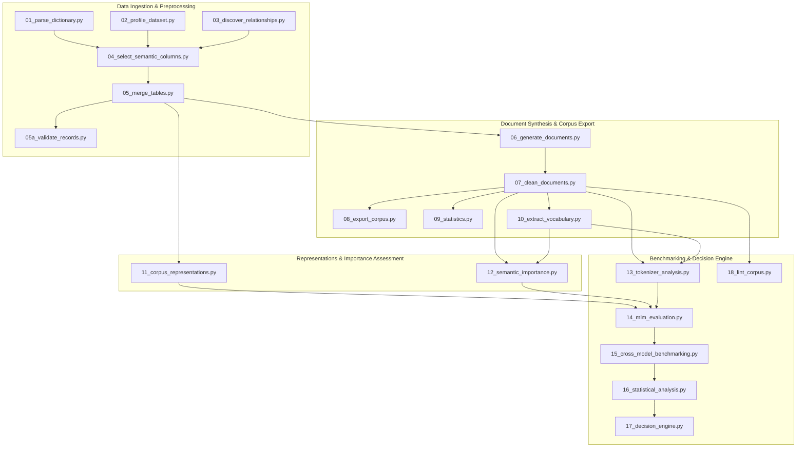

# Section 00: Overview & Pipeline Architecture

## 1. High-Level Overview

The **Maritime NLP Corpus Generation & Evaluation Pipeline** is a modular, end-to-end research framework designed to ingest raw relational databases (TSB MARSIS), process natural language accident reports, construct multi-format text representations, score semantic importance, benchmark multi-architecture tokenizers, run a 175-evaluation Masked Language Model (MLM) benchmark matrix across representative model families, perform statistical significance & feature ablation testing, and programmatically select the optimal domain adaptation strategy.

The pipeline answers the fundamental research question:
> *Does continuing Domain-Adaptive Pretraining (DAPT) on existing general language models suffice for maritime accident data, or is training a specialized domain model (**MaritimeBERT**) from scratch required?*

---

## 2. End-to-End Pipeline Architecture Diagram



---

## 3. Modular Directory Structure

```text
pipeline/
├── config/
│   └── config.json                  # Master configuration settings & threshold parameters
├── data/                            # Raw MARSIS CSV files (git-ignored)
├── scripts/                         # 18 Modular execution stage scripts & helpers
│   ├── pipeline_utils.py            # Shared logging, path resolution, encoding helpers
│   ├── text_sanitizer.py            # Text normalization & PII scrubbing regex engine
│   ├── 01_parse_dictionary.py       # Data dictionary parser
│   ├── 02_profile_dataset.py        # Statistical profiling of raw CSVs
│   ├── 03_discover_relationships.py # Foreign key discovery & cardinality mapping
│   ├── 04_select_semantic_columns.py# Semantic attribute selection
│   ├── 05_merge_tables.py           # Hierarchical relational join
│   ├── 05a_validate_records.py      # Record constraint validation
│   ├── 06_generate_documents.py     # Template narrative generation
│   ├── 07_clean_documents.py        # Header leakage stripping & normalization
│   ├── 08_export_corpus.py          # Plain text/JSONL export & SHA-256 manifest
│   ├── 09_statistics.py             # Corpus token & vocabulary statistics
│   ├── 10_extract_vocabulary.py     # Maritime TF-IDF term extraction
│   ├── 11_corpus_representations.py# 5 Multi-format representations generator
│   ├── 12_semantic_importance.py    # 9-feature semantic importance scoring engine
│   ├── 13_tokenizer_analysis.py     # Tokenizer benchmarking (fertility, coverage, speed)
│   ├── 14_mlm_evaluation.py         # 175-run MLM evaluation matrix grid
│   ├── 15_cross_model_benchmarking.py # MUI composite scoring, leaderboard, & plots
│   ├── 16_statistical_analysis.py   # Bootstrap CIs, paired t-tests, Cohen's d, ablation
│   ├── 17_decision_engine.py       # Threshold decision rules & report generation
│   └── 18_lint_corpus.py            # Corpus regex quality linting
├── outputs/                         # Exported JSON, JSONL, CSV, PNG, and MD artifacts
├── documentation/                   # Dedicated modular technical documentation
├── run_pipeline.py                  # Master CLI orchestrator
├── README.md                        # Quick start guide
└── DOCUMENTATION.md                 # Single-file master documentation
```

---

## 4. Master Orchestrator Usage (`run_pipeline.py`)

The pipeline can be run in its entirety or stage-by-stage using `run_pipeline.py`:

```bash
# Execute all 18 stages sequentially
python run_pipeline.py

# Execute a specific stage (e.g. Stage 15 Cross-Model Benchmarking)
python run_pipeline.py --stage 15
```
